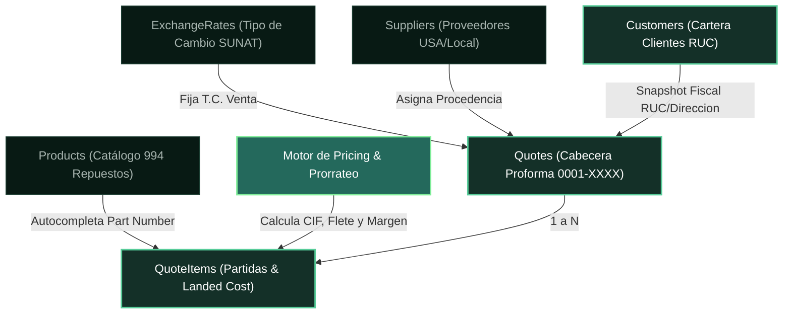
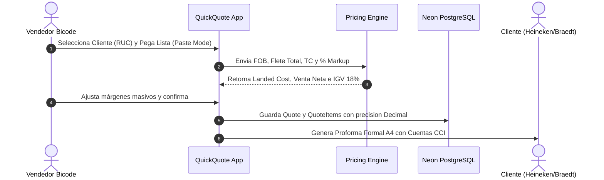

# 🗄️ DB Mermaid - Diagrama de Flujo y Tablas

Diagrama de dependencias y flujo de datos entre las entidades de QuickQuote Industrial en Neon PostgreSQL.

```mermaid
graph TD
    classDef mainTable fill:#143028,stroke:#57cc99,stroke-width:2px,color:#ffffff;
    classDef paramTable fill:#081a14,stroke:#1d4034,stroke-width:1px,color:#a8b5b0;
    classDef calcNode fill:#24695c,stroke:#80ed99,stroke-width:2px,color:#ffffff;

    ER["ExchangeRates (Tipo de Cambio SUNAT)"]:::paramTable
    SUP["Suppliers (Proveedores USA/Local)"]:::paramTable
    CUST["Customers (Cartera Clientes RUC)"]:::mainTable
    PROD["Products (Catálogo 994 Repuestos)"]:::paramTable

    QUO["Quotes (Cabecera Proforma 0001-XXXX)"]:::mainTable
    ITEM["QuoteItems (Partidas & Landed Cost)"]:::mainTable

    ENGINE["Motor de Pricing & Prorrateo"]:::calcNode

    ER -->|"Fija T.C. Venta"| QUO
    SUP -->|"Asigna Procedencia"| QUO
    CUST -->|"Snapshot Fiscal RUC/Direccion"| QUO

    PROD -->|"Autocompleta Part Number"| ITEM
    ENGINE -->|"Calcula CIF, Flete y Margen"| ITEM

    QUO -->|"1 a N"| ITEM
```

---

## Flujo Transaccional de Datos

```mermaid
sequenceDiagram
    autonumber
    actor Vendedor as Vendedor Bicode
    participant UI as QuickQuote App
    participant Engine as Pricing Engine
    participant DB as Neon PostgreSQL
    actor Cliente as Cliente (Heineken/Braedt)

    Vendedor->>UI: Selecciona Cliente (RUC) y Pega Lista (Paste Mode)
    UI->>Engine: Envia FOB, Flete Total, TC y % Markup
    Engine-->>UI: Retorna Landed Cost, Venta Neta e IGV 18%
    Vendedor->>UI: Ajusta márgenes masivos y confirma
    UI->>DB: Guarda Quote y QuoteItems con precision Decimal
    UI->>Cliente: Genera Proforma Formal A4 con Cuentas CCI
```

