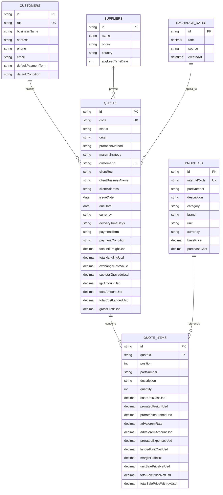

# 📊 E-R Mermaid - Diagrama Entidad-Relación

Diagrama Entidad-Relación formal en sintaxis Mermaid de QuickQuote Industrial en Neon PostgreSQL.

```mermaid
erDiagram
    CUSTOMERS ||--o{ QUOTES : "solicita"
    SUPPLIERS ||--o{ QUOTES : "provee"
    EXCHANGE_RATES ||--o{ QUOTES : "aplica_tc"
    QUOTES ||--|{ QUOTE_ITEMS : "contiene"
    PRODUCTS ||--o{ QUOTE_ITEMS : "referencia"

    CUSTOMERS {
        string id PK
        string ruc UK
        string businessName
        string address
        string phone
        string email
        string defaultPaymentTerm
        string defaultCondition
    }

    SUPPLIERS {
        string id PK
        string name
        string origin
        string country
        int avgLeadTimeDays
    }

    EXCHANGE_RATES {
        string id PK
        decimal rate
        string source
        datetime createdAt
    }

    PRODUCTS {
        string id PK
        string internalCode UK
        string partNumber
        string description
        string category
        string brand
        string unit
        string currency
        decimal basePrice
        decimal purchaseCost
    }

    QUOTES {
        string id PK
        string code UK
        string status
        string origin
        string prorationMethod
        string marginStrategy
        string customerId FK
        string clientRuc
        string clientBusinessName
        string clientAddress
        date issueDate
        date dueDate
        string currency
        string deliveryTimeDays
        string paymentTerm
        string paymentCondition
        decimal totalIntlFreightUsd
        decimal totalHandlingUsd
        decimal exchangeRateValue
        decimal subtotalGravadoUsd
        decimal igvAmountUsd
        decimal totalAmountUsd
        decimal totalCostLandedUsd
        decimal grossProfitUsd
    }

    QUOTE_ITEMS {
        string id PK
        string quoteId FK
        int position
        string partNumber
        string description
        int quantity
        decimal baseUnitCostUsd
        decimal proratedFreightUsd
        decimal proratedInsuranceUsd
        decimal adValoremRate
        decimal adValoremAmountUsd
        decimal proratedExpensesUsd
        decimal landedUnitCostUsd
        decimal marginRatePct
        decimal unitSalePriceNetUsd
        decimal totalSalePriceNetUsd
        decimal totalSalePriceWithIgvUsd
    }
```

